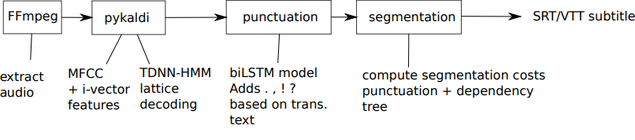

# Subtitle2go - Open Source Automatic Lecture Subtitling

Subtitle2go is a fully automatic solution for German video subtitling, with a focus on lecture videos. The project uses open source models and scripts for German ASR, automatic punctuation reconstruction and subtitle segmentation. But it should be straight-forward to support other languages as well and PRs are welcome!

Our German Kaldi models are based on the [kaldi-tuda-de](https://github.com/uhh-lt/kaldi-tuda-de) TDNN-HMM recipe. This is a Large Vocabulary Continuous Speech Recognition (LVCSR) model trained on about 1700h of German speech data.

[Punctuator2](https://github.com/ottokart/punctuator2) is used for punctuation reconstruction (,.?!)

Subtitle2go uses a custom solution for segmentation, with a beam search segmentation algorithm that searches for the best "segmentation path" with user specified criteria such as average length and variance. Punctuation and distances in parsing trees are used to estimate splitting costs.



## News

### 01.11.2021

https://lecture2go.uni-hamburg.de/open-source is using subtitle2go in its production system!

### 03.03.2021
+ We presented Subtitle2Go at [ESSV2021](http://www.essv.de/essv2021/program/). You can check out our paper [here](http://www.essv.de/essv2021/pdfs/33_milde_v2.pdf) and [here (mirror)](https://www.inf.uni-hamburg.de/en/inst/ab/lt/publications/2021-mildeetal-subtitle.pdf).

### 24.10.2020
+ Added punctuation model (with punctuator2)
+ Added a better subtitle segmentation algorithm

## Requirements
+ Python 3.9 (recommended), or Python 3.8/3.7
+ Ubuntu 20.04 (other versions may work as well)
+ X86_64 processor

## Installguide

This installation guide installs all dependencies, scripts and downloads pre-trained models (Kaldi+punctuator2).

```
# Ubuntu: make sure you have Python 3.9, its dev package and ffmpeg installed:
sudo apt-get update
sudo apt-get install python3.9 python3.9-dev ffmpeg

# Ubuntu: if python3.9 is not available, you can activate the deadsnakes Python PPA, in order to install python 3.9 through this PPA
sudo add-apt-repository ppa:deadsnakes/ppa
sudo apt-get update
sudo apt-get install python3.9 python3.9-dev

# Now clone the subtitle2go package somwhere:
mkdir ~/projects/
cd ~/projects/
git clone https://github.com/uhh-lt/subtitle2go
cd subtitle2go/

# create virtual env and install python dependencies:

virtualenv -p /usr/bin/python3.9 subtitle2go_env
source subtitle2go_env/bin/activate
pip3 install numpy pyyaml ffmpeg-python theano spacy pdfplumber python_speech_features scipy
python3 -m spacy download de_core_news_lg
python3 -m spacy download en_core_web_lg

# Now install PyKaldi
wget https://ltdata1.informatik.uni-hamburg.de/pykaldi/pykaldi-0.2.2-cp39-cp39-linux_x86_64.whl
pip3 install pykaldi-0.2.2-cp39-cp39-linux_x86_64.whl

# Install Kaldi and Intel MKL (see note below if you have a different CPU than Intel)

./install_mkl.sh
./install_kaldi_intel.sh ~/projects/subtitle2go/subtitle2go_env/bin/python3

# OR if you have a non-Intel CPU:
./install_kaldi.sh ~/projects/subtitle2go/subtitle2go_env/bin/python3

# Install punctuator2 for automatic punctuation
git clone https://github.com/ottokart/punctuator2.git

# Patch punctuator2:

Open punctuator2/models.py in a file editor, go to line 54 and replace "from . import models" with "import models"

# Download pretrained models:
./download_models.sh
```

## Optional: redis status updates

subtitle2go.py can optionally send status updates to a redis instance. You can either connect to the redis server channel "subtitle2go" directly and receive update events. Alternatively you can run event_server.py to get a HTTP API to poll the status of all past and current subtitle2go.py runs.

The following packages only need to be installed if you want to use this feature. Subtitle2go.py will automatically figure out if the redis package is available and enables/disables the accordingly.

```
sudo apt-get redis-server
```

and on Mac Os X:

```
brew install redis
```

The following additional pip packages are also needed:

```
pip3 install redis flask gunicorn
```

## Subtitle2go.py usage

Put a mediafile (eg `mediafile.mp4`) in the directory and then run:

```
source subtitle2go_env/bin/activate
. path.sh
python3 subtitle2go.py mediafile.mp4
```

The subtitle is then generated as `mediafile.vtt`

Optional: If you want to send status updates of the processing to redis/event_server then you need to append --with-redis-updates to subtitle2go.py:

```
python3 subtitle2go.py --with-redis-updates mediafile.mp4
```

If you start the wsgi server with ./start_eventserver_wsgi.sh then you can see status updates of every subtitle2go.py run at http://127.0.0.1:7500/status 

You can also clear successful and failed runs with http://127.0.0.1:7500/clear 

Redis server needs to be running.

# Subtitle2go.py program arguments

The following arguments are available:

```
usage: subtitle2go.py [-h] [-s {vtt,srt}] [--asr-beam-size ASR_BEAM_SIZE]
                           [--asr-max-active ASR_MAX_ACTIVE]
                           [--segment-beam-size SEGMENT_BEAM_SIZE]
                           [--ideal-token-len IDEAL_TOKEN_LEN]
                           [--len-reward-factor LEN_REWARD_FACTOR]
                           [--sentence-end-reward_factor SENTENCE_END_REWARD_FACTOR]
                           [--comma-end-reward-factor COMMA_END_REWARD_FACTOR]
                           [--with-redis-updates]
                           filename

positional arguments:
  filename              The path of the mediafile

optional arguments:
  -h, --help            show this help message and exit
  -s {vtt,srt}, --subtitle {vtt,srt}
                        The output subtitleformat (vtt or srt). Default=vtt
  --asr-beam-size ASR_BEAM_SIZE
                        ASR decoder option: controls the beam size in the beam
                        search. This is a speed / accuracy tradeoff.
  --asr-max-active ASR_MAX_ACTIVE
                        ASR decoder option: controls the maximum number of
                        states that can be active at one time.
  --segment-beam-size SEGMENT_BEAM_SIZE
                        What beam size to use for the segmentation search
  --ideal-token-len IDEAL_TOKEN_LEN
                        The ideal length of tokens per segment
  --len-reward-factor LEN_REWARD_FACTOR
                        How important it is to be close to ideal_token_len,
                        higher factor = splits are closer to ideal_token_len
  --sentence-end-reward_factor SENTENCE_END_REWARD_FACTOR
                        The weight of the sentence end score in the search.
                        Higher values make it more likely to always split at
                        sentence end.
  --comma-end-reward-factor COMMA_END_REWARD_FACTOR
                        The weight of the comma end score in the search.
                        Higher values make it more likely to always split at
                        commas.
  --with-redis-updates  Update a redis instance about the current progress.  
                        (This option only shows up if the redis package is available)
```

## FAQ

### Error message ImportError: libkaldi-base.so: cannot open shared object file: No such file or directory

You have to load the path.sh into your shell. You need to run:

. path.sh

Every time you start a new shell session in order to use subtitle2go

### Error message "had nonzero return status 32512"
The path of kaldi is missing or incorrect
Use
```
export KALDI_ROOT=PATH_TO_KALDI
export PATH=$KALDI_ROOT/src/lmbin/:$KALDI_ROOT/../kaldi_lm/:$PWD/utils/:$KALDI_ROOT/src/bin:$KALDI_ROOT/tools/openfst/bin:$KALDI_ROOT/src/fstbin/:$KALDI_ROOT/src/gmmbin/:$KALDI_ROOT/src/featbin/:$KALDI_ROOT/src/lm/:$KALDI_ROOT/src/sgmmbin/:$KALDI_ROOT/src/sgmm2bin/:$KALDI_ROOT/src/fgmmbin/:$KALDI_ROOT/src/latbin/:$KALDI_ROOT/src/nnetbin:$KALDI_ROOT/src/nnet2bin/:$KALDI_ROOT/src/online2bin/:$KALDI_ROOT/src/ivectorbin/:$KALDI_ROOT/src/kwsbin:$KALDI_ROOT/src/nnet3bin:$KALDI_ROOT/src/chainbin:$KALDI_ROOT/tools/sph2pipe_v2.5/:$KALDI_ROOT/src/rnnlmbin:$PWD:$PATH
```
and replace PATH_TO_KALDI with the path to your kaldi binaries (eg. pykaldi/tools/kaldi)

## References

If you use Subtitle2Go in your academic work, please cite [this paper](http://www.essv.de/essv2021/pdfs/33_milde_v2.pdf):

    @InProceedings{milde-etal-21-subtitle2go,
      author={Benjamin Milde and Robert Geislinger and Irina Lindt and Timo Baumann},
      title={Open Source Automatic Lecture Subtitling},
      booktitle={Proceedings of ESSV 2021},
      year={2021},
      pages={128--134},
      address={Virtual Berlin, Germany}
    }

and for the German ASR model:

    @InProceedings{milde-koehn-18-german-asr,
      author={Benjamin Milde and Arne K{\"o}hn},
      title={Open Source Automatic Speech Recognition for German},
      booktitle={Proceedings of ITG 2018},
      year={2018},
      pages={251--255},
      address={Oldenburg, Germany}
    }

Thanks!
